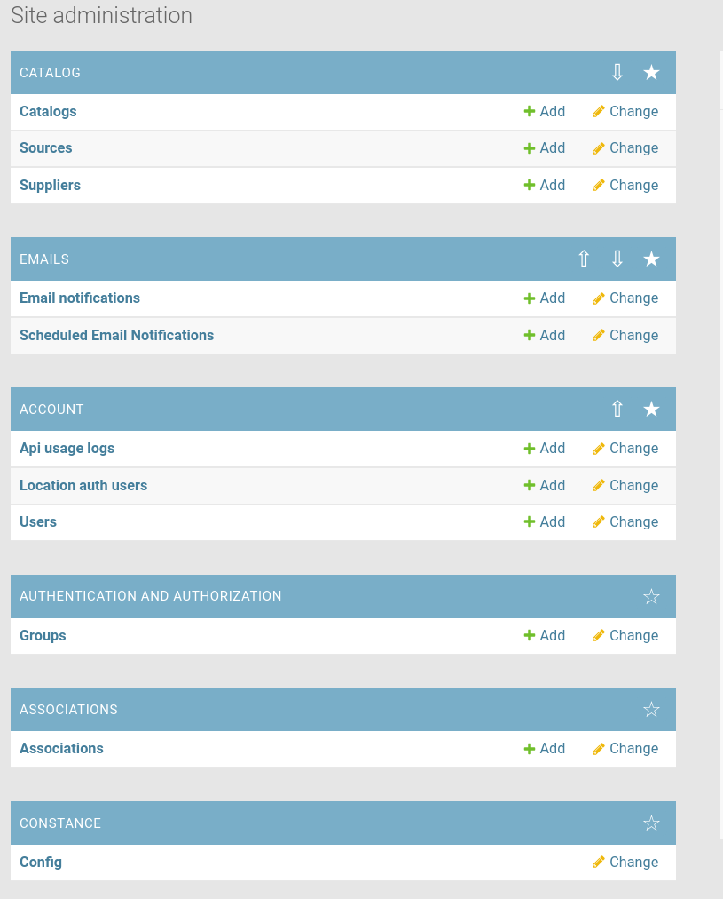

# Django Admin App Bookmark

Adds a way to bookmark apps in django admin and order them.

# Features
- bookmark apps from admin index page
- bookmarked apps are listed on top
- change order of bookmarked apps
- on app change list and model object views automatically scroll sidebar to current app



# Install
1. Install package
```bash
pip insatll https://github.com/kostyachum/django-admin-app-bookmark
```

2. Add to django's `INSTALLED_APPS` into the begining:
```python

INSTALLED_APPS = [
    'app_bookmarks',
    'app_bookmarks.apps_config.BookmarkAdminConfig',
    ...
]
```

3. Remove default admin `django.contrib.admin` site from `INSTALLED_APPS`
4. Apply migrates and collect static


# Limitation
At the current state only works if your user's PK is UUID.
